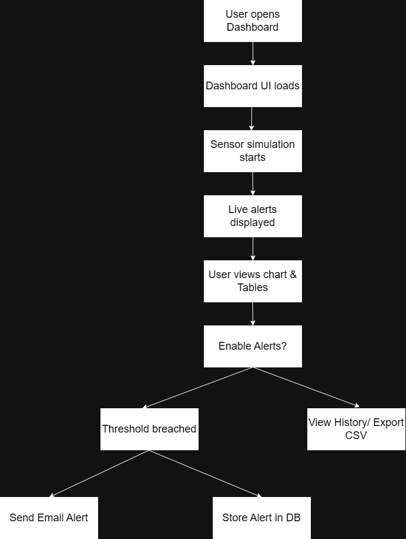
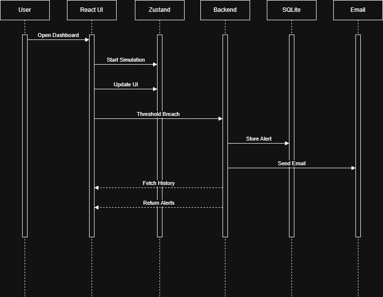

IoT Sensor Monitoring Dashboard

   Real-time IoT Sensor Monitoring Dashboard using React and Node. js searchable table visualization of live sensor data, auto alerts and categorized alert history.

   A.	Features
      •	Live emulation of IoT sensor (Temp, Humidity, Pressure) data
      •	Real time updating line charts for sensor trends
      •	Paginated table of sensor readings - (20 readings, 10 per page)
      •	Email alerts based on threshold WARN and CRITICAL levels
      •	Allow users to toggle Alert Enabled / Disabled from UI
      •	Notification history stored in the SQLite database
      •	Report export of alert history to CSV
      •	Professional, responsive and clean dashboard UI

   B.	Tech Stack
      •	Frontend
         	React.js
         	Zustand (State Management)
         	Recharts (Data Visualization)
         	HTML5, CSS3, JavaScript (ES6+)

      •	Backend
         	Node.js
         	Express.js
         	Nodemailer (Email Alerts)
         	SQLite (Alert History Database)

   C.	Alert Thresholds

   Sensor           | Warning Level	|Critical Level
   -----------------|---------------|-------------
   Temperature (°C) |> 30 °C	      |≥ 35 °C
   Humidity (%)	  |> 70 %	      |≥ 85 %
   Pressure (hPa)	  |> 1020 hPa	   |≥ 1030 hPa

   D.	System Architecture

      React Dashboard
      ↓
      REST API (Node. js / Express)
      ↓
      SQLite Database (Alert History)
      ↓
      Email Notifications

   E.	How to Run Locally

      Step 1: Clone the repository
      git clone https://github.com/jithendrababug/IoT-Dashboard.git

      Step 2: Run the Frontend
      >cd iot-dashboard
      >npm install
      >npm start
      App runs on: http://localhost:3000

      Step 3:  Run the Backend
      >cd iot-alert-backend
      >npm install
      >npm start
      Backend runs on: http://localhost:5000
      > Email credentials are securely managed using environment variables (.env file).

   F.	Database
      •	Alert history is stored in a local SQLite database (alerts.db)
      •	Each alert includes:
         	Date & Time
         	Severity (WARNING / CRITICAL)
         	Sensor values
         	Trigger message

   G.	Key Highlights

      •	Real-time data handling and visualization
      •	Secure backend architecture with environment-based configuration
      •	Production-style alerting system with cooldown logic
      •	Practical features like alert history tracking and CSV export
      •	Well-structured frontend and backend separation

   H.	Future Enhancements

      •	Integrate live sensor data from IoT devices (ESP32/Raspberry Pi) using MQTT or WebSockets to replace simulated readings.
      •	Allow users to dynamically configure sensor threshold limits through the dashboard and store them persistently.
      •	Add secure login with role-based permissions to restrict alert configuration and data access.
      •	Migrate the backend and database to a cloud environment to support multi-user access and scalability.
      Introduce historical trend analysis and predictive alerts using basic machine learning models.

   --User Flow Diagram--
   

   --Sequence Diagram--
   

--Author--
Jithendra Babu G

--License--
This project is open-source and available under the MIT License.
